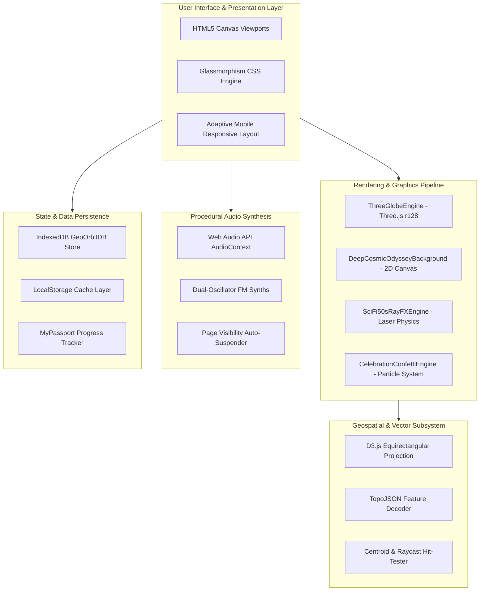

# 🏛️ Technical Architecture & Engineering Design: GEO ORBIT 3D

This document details the architectural decisions, rendering pipeline, mathematical models, procedural audio graph, and data persistence layers of **GEO ORBIT: World Odyssey 3D**.

---

## 1. High-Level Architecture

Geo Orbit is built with a zero-compilation, zero-dependency vanilla architecture engineered for sub-second load times and high framerates across low-power mobile devices.



---

## 2. 3D Globe & Cartographic Mathematics

### 2.1 Coordinate Projection and Spherical Mapping
The 3D Earth is constructed using a Three.js `SphereGeometry(1.0, 64, 64)`. Geographic coordinates $(\lambda, \phi)$ in degrees (longitude $\lambda \in [-180, 180]$, latitude $\phi \in [-90, 90]$) are converted into texture space using an equirectangular projection onto an off-screen $2048 \times 1024$ canvas:

$$\text{Texture}_X = (\lambda + 180) \cdot \frac{2048}{360}$$
$$\text{Texture}_Y = (90 - \phi) \cdot \frac{1024}{180}$$

When centering a target nation on the front of the globe ($Z > 0$), the required Euler rotation angles $(\theta_X, \theta_Y)$ are calculated as:

$$\theta_Y = -(\lambda_{\text{target}} + 90^\circ)$$
$$\theta_X = \phi_{\text{target}}$$

### 2.2 Dynamic Camera Interpolation
During a planetary spin, the camera interpolates along a quadratic spline:
- **Phase 1 (Zoom Out, $t \in [0, 0.6]$)**: Camera retreats from $Z = 2.8$ to $Z = 3.6$ to ensure full planetary visibility on mobile screens.
- **Phase 2 (Zoom In, $t \in [0.6, 1.0]$)**: Camera smoothly approaches $Z = 2.55$, focusing intently on the selected nation's borders.

### 2.3 Raycast Selection & Ocean Hit-Testing
Raycasting against the spherical geometry translates mouse or touch coordinates to $(\text{UV}_X, \text{UV}_Y)$, which maps directly to $(\lambda, \phi)$. Point-in-polygon tests are performed via `d3.geoContains()`. If no terrestrial polygon is hit, the nearest oceanic bounding box is evaluated to identify oceans and seas.

---

## 3. Procedural Audio Synthesis Architecture

Geo Orbit requires **zero external MP3/WAV audio files**, eliminating asset loading latency and bandwidth consumption. All sounds are generated procedurally via the Web Audio API:

```
[ Oscillator 1 (Carrier) ] ──┐
                             ├──> [ Biquad Filter ] ──> [ Master Gain ] ──> [ AudioDestination ]
[ Oscillator 2 (Modulator)] ──┘
          ▲
          │ Frequency Modulation
    [ LFO Synth ]
```

- **Crystalline Water Droplets**: Dual high-frequency sine oscillators ($1150\text{Hz} \to 2250\text{Hz}$ and $3400\text{Hz} \to 4200\text{Hz}$) with exponential gain decays ($< 180\text{ms}$).
- **Sub-Bass Heartbeat**: Pure sine wave decaying from $(48 + 25 \times \text{urgency})\text{Hz}$ down to $30\text{Hz}$.
- **1950s Sci-Fi Raycasters**: Frequency-modulated sawtooth carrier ($1800\text{Hz} \to 160\text{Hz}$) modulated by a $24\text{Hz}$ LFO through a high-Q bandpass filter ($1200\text{Hz}, Q = 6.5$).

---

## 4. State Machine & Persistence Layer

The game lifecycle is orchestrated through a deterministic state machine:

```
[ Splash Menu ] ──> [ Spin Globe (Zoom Out) ] ──> [ Focus Country (Zoom In) ] 
       ▲                                                           │
       │                                                           ▼
 [ Return Menu ] <── [ Game Over / Top 10 ] <── [ Question & Answer Lock ]
                                                           │
                                                           ▼
                                                [ Correct / Incorrect Banner ]
                                                           │
                                                           ▼
                                                [ Next Spin / Trivia Modal ]
```

### Dual Storage Engine (IndexedDB + LocalStorage)
- Primary read/write occurs in memory and syncs to `localStorage['MY_WORLD_APP_TOP10_MASTER_V24']`.
- Concurrently, entries are stored in IndexedDB `GeoOrbitDB` under object store `HighScores`.
- If local storage is purged by the browser, the app transparently restores records from IndexedDB upon initialization.
