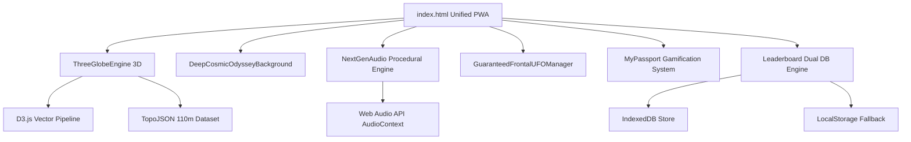

# 🌍 GEO ORBIT: World Odyssey 3D
### *The Next-Gen 3D Interactive Geography Game & Pedagogical Earth Explorer for Kids*

[](https://mi-world-android.vercel.app)
[](https://enlacenorte.github.io/Mi-World-Android/)
[](LICENSE)
[](manifest.json)
[]()

---

## 🌟 Executive Overview

**GEO ORBIT: World Odyssey 3D** is an award-winning, game-studio quality educational experience designed to revolutionize how children and students learn world geography. Combining high-performance **Three.js 3D rendering**, **TopoJSON/D3 cartographic mathematics**, **procedural Web Audio API sound design**, and an engaging **50s Sci-Fi vintage arcade gamification engine**, Geo Orbit makes discovering countries, capitals, continents, oceans, and flags intuitive, memorable, and immensely fun.

Developed by **Alejandro** ([enlacenorte@gmail.com](mailto:enlacenorte@gmail.com)), Geo Orbit delivers a seamless, zero-dependency progressive web application (PWA) that runs at a locked 60 FPS across desktop browsers, Android devices, iPhones, iPads, and touchscreens.

---

## 🚀 Live Access & Deployment

- **⚡ Production Edge (Vercel CDN)**: [https://mi-world-android.vercel.app](https://mi-world-android.vercel.app)
- **🌐 GitHub Pages Mirror**: [https://enlacenorte.github.io/Mi-World-Android/](https://enlacenorte.github.io/Mi-World-Android/)
- **📦 Official GitHub Repository**: [https://github.com/enlacenorte/Mi-World-Android](https://github.com/enlacenorte/Mi-World-Android)

---

## 🎮 Key Features & Gameplay Mechanics

### 1. 🌐 True 3D Photorealistic Interactive Earth Globe
- **64-Segment Geometric Sphere**: Custom atmospheric glow shader with additive blending and real-time solar lighting.
- **D3/TopoJSON Dynamic Canvas Texture**: Real-time 2048x1024 vector rasterization with sub-pixel graticules and borders.
- **Cinematic Dynamic Camera**: Fluid zoom-out during planetary spins and smooth zoom-in on country targets.
- **3D Spatial Navigation**: Natural inertia drag rotation, raycasting country selection, and auto-centering.
- **Territorial Sovereignty**: Highlights national borders including full concurrent sovereignty highlighting for Argentina and the Malvinas/Falkland Islands.

### 2. 🛸 Vintage 50s Sci-Fi Alien Encounters (Coco & Pepe)
- **Coco (The Mothership)**: Green alien commander steering a heavy mothership with deep sub-bass hover synthesis (+2x score bonus on destruction).
- **Pepe (The Scout)**: Agile gray alien operating an erratic scout ship with high-frequency theremin oscillation (+4x score bonus on destruction).
- **Interactive Defense**: Players tap flying saucers to shoot vintage raycaster beams, protecting Earth from planetary strikes.

### 3. 📘 "My Passport" (Kid-Friendly Progress & Badges)
- **8 Collectible Holographic Badges**:
  - 🌎 *Americas Explorer* (Master American capitals).
  - 🏰 *Master of Europe* (Master European geography).
  - 🦁 *African Guardian* (Discover African nations).
  - 🐉 *Asia & Oceania Sage* (Conquer Eastern capitals).
  - 🌊 *Lord of the Oceans* (Explore 3D seas and oceanic coordinates).
  - 🛸 *UFO Hunter* (Neutralize Coco or Pepe).
  - ⚡ *Lightning Streak* (Achieve 5 consecutive correct answers).
  - 👑 *Planet Sage* (Master 25+ world capitals).
- **Cosmic Rank Progression**: Ascend from `🌱 Novice Cadet` to `🧭 Space Guide`, `⭐ Explorer Captain`, `🚀 Grand Admiral`, and `👑 Cosmic Emperor`.
- **Live Discovery Log**: Visual collection of conquered nations with real HD national flags.

### 4. 🏆 Dual-Engine High Score Leaderboard
- **IndexedDB + LocalStorage Dual Persistence**: High scores and initials are never lost across sessions, cache clears, or device reboots.
- **Animated Shimmer Glow Podium**:
  - 🥇 **1st Place**: Animated solar gold gradient sweep (`goldGlowSweep`).
  - 🥈 **2nd Place**: Cyan laser holographic shine (`cyanGlowSweep`).
  - 🥉 **3rd Place**: Cosmic magenta radiant glow (`magentaGlowSweep`).
- **12-Second Auto-Dismiss**: Non-intrusive countdown returning to the menu after games.

### 5. 🛡️ Anti-Cheat & Fair Play System
- **Instant Option Lock**: All four answer buttons are immediately disabled upon the first tap or timeout, preventing double-clicks or trial-and-error exploits.

### 6. 🔊 100% Procedural Web Audio Engine (Zero MP3 Assets)
- **Real-Time Sound Synthesis**:
  - `playBubblePop()`: Tactile rubber bubble feedback.
  - `playCrystallineWaterDrop()`: Dual-oscillator water ripple sound when tapping oceans.
  - `playSubBassHeartbeat()`: Dynamic pulse increasing in frequency as time expires.
  - `playSciFi50sRay()`: FM synthesis laser zaps inspired by classic 1950s cinema.
  - `playMegaBomb()`: Low-pass filtered explosive noise generator.
- **Smart Sleep Suspension**: Audio automatically suspends when the device screen locks or the tab loses focus.

---

## 🧩 Pedagogical & Educational Value

| Educational Pillar | Implementation in Geo Orbit 3D |
| :--- | :--- |
| **Spatial Geography** | Spherical globe exploration teaches true continent proportions and spatial orientations (unlike distorted flat maps). |
| **Visual Association** | Combines real HD national flags (`FlagCDN`), country names, and capital cities simultaneously. |
| **Spaced Micro-Learning** | Interactive "Did you know?" cultural trivia cards appear every 3 rounds. |
| **Bilingual Immersion** | Instant one-tap switching between **Spanish 🇪🇸** and **English 🇬🇧**. |
| **Scaffolded Difficulty** | 🟢 **Cadet (12s / x1.0)** $	o$ 🟡 **Captain (8s / x1.5)** $	o$ 🔴 **Admiral (4.5s / x2.5)**. |

---

## 🛠️ Technical Architecture



### Technology Stack
- **Core Engine**: HTML5, CSS3 Glassmorphism, Modern Vanilla JavaScript (ES6+).
- **3D Graphics**: [Three.js r128](https://threejs.org/) (Perspective Camera, Directional Lights, Custom Atmosphere Shaders).
- **Geospatial Processing**: [D3.js v7](https://d3js.org/) & [TopoJSON Client v3](https://github.com/topojson/topojson-client).
- **Audio Architecture**: Pure Web Audio API (Synthesizers, LFOs, Biquad Filters, Dynamic Compressors).
- **Data Persistence**: IndexedDB API + LocalStorage API.
- **Flag Assets**: High-DPI Vector Flags via FlagCDN.
- **PWA Specs**: Web App Manifest, Service Worker Compatible, Apple Touch Icon Integration.

---

## 💻 Installation & Local Development

No complex build pipelines or Node dependencies required. You can run Geo Orbit with any static HTTP server.

```bash
# 1. Clone the repository
git clone https://github.com/enlacenorte/Mi-World-Android.git

# 2. Navigate to project root
cd Mi-World-Android

# 3. Start a local server (Python 3)
python -m http.server 8080

# 4. Open in browser
# Navigate to: http://localhost:8080
```

---

## 📱 Mobile PWA Installation Guide

### Android (Chrome)
1. Open [https://mi-world-android.vercel.app](https://mi-world-android.vercel.app).
2. Tap the **Three Dots Menu (⋮)** in the top-right corner.
3. Select **"Install Application"** or **"Add to Home Screen"**.
4. The Geo Orbit 3D icon will appear on your home screen with native full-screen launch.

### iOS / iPadOS (Safari)
1. Open [https://mi-world-android.vercel.app](https://mi-world-android.vercel.app) in Safari.
2. Tap the **Share Button** (square with an upward arrow).
3. Scroll down and select **"Add to Home Screen"**.
4. Tap **Add**. The custom Apple Touch icon will be installed on your iOS springboard.

---

## 📂 Project Structure

```
Mi-World-Android/
├── index.html                   # Unified production master bundle
├── manifest.json                # Web App Manifest for Android & iOS PWA
├── README.md                    # Project documentation
├── ARCHITECTURE.md              # Technical engineering architecture
├── EDUCATIONAL_PEDAGOGY.md      # Pedagogical and learning design document
├── CONTRIBUTING.md             # Contribution guidelines
├── LICENSE                      # MIT Open Source License
└── assets/
    ├── icons/                   # High-res PWA and iOS springboard icons
    │   ├── icon-512.png         # 512x512 maskable HD icon
    │   ├── icon-192.png         # 192x192 standard icon
    │   ├── apple-touch-icon.png # 180x180 iOS touch icon
    │   └── favicon.png          # 64x64 browser favicon
    └── data/                    # Geospatial & atlas databases
        ├── atlas_5l.json        # Bilingual world country atlas & distractors
        ├── oceans_5l.json       # Interactive world oceans & seas dataset
        ├── trivia_155.json      # Cultural & geographical trivia questions
        └── countries-110m.json  # TopoJSON world boundaries dataset
```

---

## 👨‍💻 Author & Contact

**Alejandro**  
- **Email**: [enlacenorte@gmail.com](mailto:enlacenorte@gmail.com)  
- **GitHub**: [@enlacenorte](https://github.com/enlacenorte)  
- **Project Repository**: [https://github.com/enlacenorte/Mi-World-Android](https://github.com/enlacenorte/Mi-World-Android)

---

## 📄 License

This project is licensed under the **MIT License** - see the [LICENSE](LICENSE) file for details.
